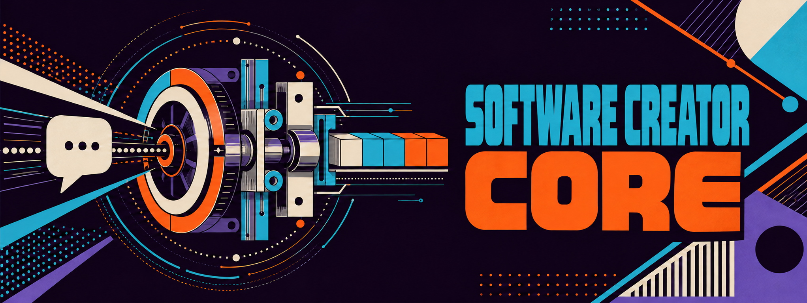

  

# Software Creator Core

Shared definitions, composition contracts, controls, and optional execution harnesses for building trustworthy products.

## Foundations

1. [Development principles](docs/core/development-principles.md) — promises about the software PDLC helps teams create and the way that work is carried out.
2. [Engineering standards](docs/standards/README.md) — enforceable requirements describing what must be true.
3. [Core–Product Consumption Model](docs/architecture/README.md) — architectural contracts describing how Core and downstream product repositories compose and evolve.
4. [Agent qualification gate](docs/agents/agent-qualification-gate.md) — mandatory evidence-based admission criteria for deciding whether a proposed responsibility should become an agent role.
5. [Agent evaluation and qualification protocol](docs/agents/agent-evaluation-and-qualification-protocol.md) — controlled, comparative assessment of whether an exact agent build has demonstrated the competence its role claims.

## Consumable definitions

1. [Agent definitions](definitions/agents/README.md) — versioned, platform-neutral professional baselines that can be consumed without the Core runtime or reference harness.

## Licence

Software Creator Core is free and open-source software licensed under the
[GNU Affero General Public License, version 3 or later](LICENSE.md)
(`AGPL-3.0-or-later`). Commercial use is permitted subject to the licence
terms. See [Licensing](LICENSING.md) for a plain-language overview.

Copyright © 2026 Bharath Vadhoola
