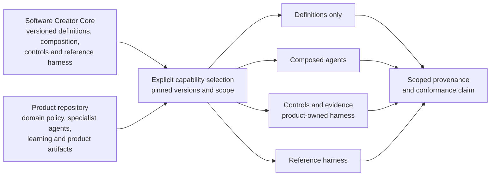

# Core–Product Consumption Model

**Status:** Adopted initial architecture  
**Effective:** 9 August 2026  
**Governed by:** [Development principles](../core/development-principles.md) and [Engineering standards](../standards/README.md)

Software Creator Core is a modular product-development foundation. A downstream product repository may consume one or more immutable Core definitions, composed agents, controls and evidence contracts, or the optional reference harness. It owns its domain decisions, product artifacts, specialist behaviour, and learning.

The architecture separates durable Core capabilities from product-specific policy. Consumers select only the capabilities they need through supported public contracts; adopting one capability does not activate or imply conformance with the others.

## Architecture documents

1. [Supported consumption modes](consumption-modes.md)
2. [Core and product repository responsibility model](core-product-responsibility-model.md)
3. [Versioned Core and product repositories](versioned-core-and-product-repositories.md)
4. [Runtime job-context composition](runtime-job-context-composition.md)
5. [Persisted job and evidence artifact model](job-and-evidence-artifact-model.md)
6. [Product repository lifecycle](product-repository-lifecycle.md)

These documents are normative architectural constraints. Commands, file layouts, and schemas labelled **conceptual** describe intended future interfaces; their presence here does not claim that an implementation exists.

The [0.1.0a1 Core foundation](../core/implementation.md) implements a bounded
delivery subset with experimental contracts and session handoffs. Its supported
behaviour and limitations are documented separately. The broader consumer
lifecycle below remains the architectural target, not a claim that adoption,
migration, arbitrary routing or agent qualification is complete.

## System model



## Architectural decisions

- Core publishes independently consumable, versioned capabilities through stable public contracts.
- Product repositories own domain policy, product behaviour, local learning, and delivery artifacts.
- Products explicitly select the capabilities they consume; the complete reference harness is optional.
- The reference harness uses the same public contracts available to a product-owned or third-party harness.
- Product specialisation may extend or tighten Core requirements but may not silently weaken them.
- A product repository pins every consumed Core release or artifact; it does not track a moving branch.
- When agent composition is selected, Core resolution records every loaded, skipped, and conflicting source.
- When the reference harness is selected, it owns workflow state, transition validation, evidence collection, and outcome classification. A custom harness retains those responsibilities itself.
- Execution modes persist durable development state in artifacts rather than relying on conversation history.
- Conformance claims are scoped to the capability, version, product workflow, executor, and evidence involved.
- Upgrades preview compatibility, preserve product-owned files, validate downstream behaviour, and roll back transactionally on failure.
- Product learning remains local until evidence shows that it is generic enough for Core.

## Composition layers

When a product selects composed agents or the reference harness, the effective behaviour for a job is composed from:

```text
Core invariant contracts
+ applicable Core standards and controls
+ Core role and workflow contracts
+ selected product and technology profiles
+ repository-owned role specialisation
+ active repository learning
+ task artifacts
+ current authority and resource limits
= resolved job context
```

Higher-authority layers cannot be replaced by lower-authority layers. Conflicts, exclusions, and missing inputs are explicit outcomes.

Definitions-only consumption does not imply that this resolution occurred. It establishes the provenance of the consumed definition and nothing broader.

## First qualified agent vertical slice

The first canonical agent must prove the smallest supported consumption mode with a role that passes the [agent qualification gate](../agents/agent-qualification-gate.md) and an exact build evaluated under the [agent evaluation and qualification protocol](../agents/agent-evaluation-and-qualification-protocol.md).

Software Creator Core does not yet publish a qualified agent definition. The first
candidate must own a recurring, bounded outcome; require distinguishable
expertise; define measurable success and independent evaluation; carry
immutable version and provenance; and remain consumable without installing a
resolver or harness. Any published competence result belongs to the exact
evaluated build and does not transfer to a definitions-only consumer. Use of
the definition may claim its provenance only and must not imply that
composition, controls, routing, lifecycle execution, or reference-build
qualification occurred.

## Non-goals

This architecture does not yet:

- Select an implementation language or packaging ecosystem.
- Define every agent or workflow.
- Treat documentation as proof that a control is automated.
- Permit product repositories to replace Core safety or authority contracts.
- Promote local learning into Core automatically.
- Require all product repositories to use every available capability.
- Make the reference harness mandatory or give it privileged interfaces unavailable to custom harnesses.
- Continuously operate, monitor, deploy, reprioritise, or retire downstream
  products. Integrations with production and product-management systems are
  bounded, explicitly invoked, and governed by product authority.

## Acceptance criteria for the architecture

A future implementation conforms when:

- A thin product repository can pin and consume one Core definition without adopting a resolver or harness.
- Each supported consumption mode can be selected independently or combined explicitly.
- A product-owned harness can use the same Core contracts as the reference harness.
- Every consumed Core release or artifact is pinned and attributable.
- Core and product ownership are mechanically distinguishable.
- Where composition is selected, the effective context for a job is explainable before and after execution.
- Product-owned files survive creation, reruns, and upgrades.
- Applicable standards, authority, inputs, and versions appear in the evidence for execution modes.
- Historical job records remain attributable after Core evolves.
- An interrupted or failed upgrade returns the product repository to its previous valid dependency state.
- No partial adoption can be mistaken for conformance with unselected capabilities.
