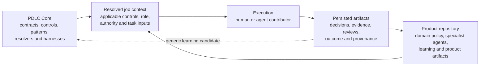

# Core–Product Consumption Model

**Status:** Adopted initial architecture  
**Effective:** 9 August 2026  
**Governed by:** [Development principles](../core/development-principles.md) and [Engineering standards](../standards/README.md)

PDLC Core is a reusable product-development execution kernel. A downstream product repository consumes an immutable Core release and owns its domain decisions, product artifacts, specialist behaviour, and learning.

The architecture separates durable Core mechanisms from product-specific policy so that Core can evolve without copying its implementation into every product repository.

## Architecture documents

1. [Supported consumption modes](consumption-modes.md)
2. [Core and product repository responsibility model](core-product-responsibility-model.md)
3. [Versioned Core and product repositories](versioned-core-and-product-repositories.md)
4. [Runtime job-context composition](runtime-job-context-composition.md)
5. [Persisted job and evidence artifact model](job-and-evidence-artifact-model.md)
6. [Product repository lifecycle](product-repository-lifecycle.md)

These documents are normative architectural constraints. Commands, file layouts, and schemas labelled **conceptual** describe intended future interfaces; their presence here does not claim that an implementation exists.

## System model



## Architectural decisions

- Core owns reusable mechanisms and non-negotiable contracts.
- Product repositories own domain policy, product behaviour, local learning, and delivery artifacts.
- Product specialisation may extend or tighten Core requirements but may not silently weaken them.
- A product repository pins an immutable Core release; it does not copy Core, use a submodule, or track a moving branch.
- Core resolves the job context and records every loaded and skipped source.
- Agents are specialised contributors. Core owns workflow state, transition validation, evidence collection, and outcome classification.
- Persisted artifacts—not conversation history—hold durable development state.
- Upgrades preview compatibility, preserve product-owned files, validate downstream behaviour, and roll back transactionally on failure.
- Product learning remains local until evidence shows that it is generic enough for Core.

## Composition layers

The effective behaviour for a job is composed from:

```text
Core invariant contracts
+ applicable Core standards and controls
+ Core role and workflow contracts
+ selected product and technology profiles
+ repository-owned role specialisation
+ active repository learning
+ task artifacts
+ current authority and resource limits
= resolved job context
```

Higher-authority layers cannot be replaced by lower-authority layers. Conflicts, exclusions, and missing inputs are explicit outcomes.

## Reference vertical slice

The first implementation should prove one narrow workflow end to end:

```text
change request
→ architecture decision
→ implementation plan
→ implementation
→ automated evidence
→ independent review
→ human approval where required
→ explicit outcome
```

A suitable first control is ES-001 cyclomatic complexity:

1. Core defines the default maximum.
2. A product repository pins Core and tightens the threshold.
3. Resolution produces one effective value with provenance.
4. A harness evaluates representative code.
5. The evidence artifact records the result.
6. An exception is visible, owned, and expiring.
7. A Core upgrade previews its effect without overwriting product configuration.

## Non-goals

This architecture does not yet:

- Select an implementation language or packaging ecosystem.
- Define every agent or workflow.
- Treat documentation as proof that a control is automated.
- Permit product repositories to replace Core safety or authority contracts.
- Promote local learning into Core automatically.
- Require all product repositories to use every available capability.

## Acceptance criteria for the architecture

A future implementation conforms when:

- A thin product repository can pin and validate a Core release.
- Core and product ownership are mechanically distinguishable.
- The effective context for a job is explainable before and after execution.
- Product-owned files survive creation, reruns, and upgrades.
- Applicable standards, authority, inputs, and versions appear in the evidence.
- Historical job records remain attributable after Core evolves.
- An interrupted or failed upgrade returns the product repository to its previous valid dependency state.
